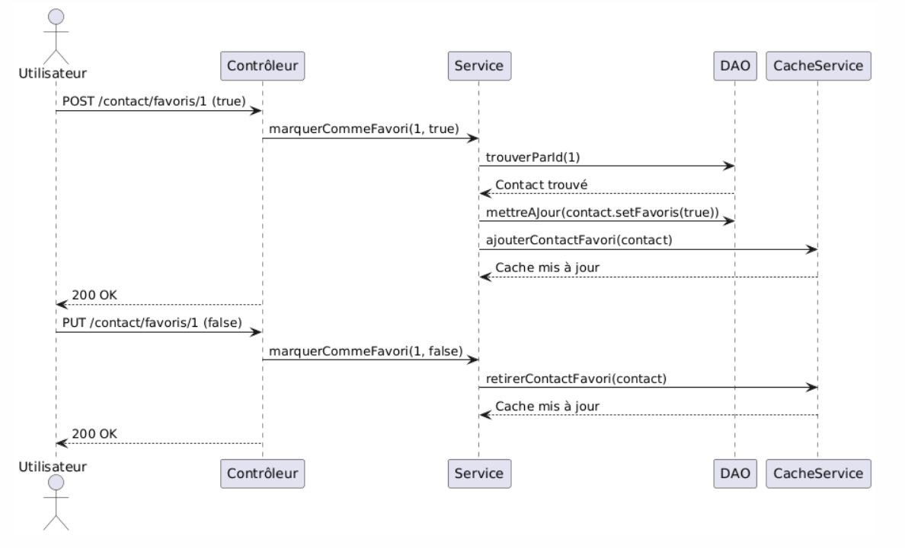

# Documentation du Projet mes_chums

## Présentation de l'Application

**Objectif de l'application :**  
L'application a pour but de gérer des contacts, leurs adresses, et de permettre la recherche de contacts à proximité d'une adresse donnée. Elle offre également la possibilité de marquer des contacts comme favoris pour faciliter un accès plus rapide.

**Fonctionnalités principales :**
- Ajouter un contact et ses adresses.
- Marquer ou dé-marquer un contact comme favori.
- Rechercher des contacts par nom.
- Rechercher des contacts à proximité (en fournissant une adresse et un rayon).
- Affichage et manipulation des contacts et de leurs adresses via des endpoints REST.

**Technologies utilisées :**
- **Langage de programmation** : Java  
- **Gestionnaire de projet** : Maven (pour la gestion des dépendances et le cycle de construction)  
- **Serveur** : HttpServer fourni par le JDK  
- **Base de données** : SQLite (interrogée via JDBC)  
- **API de Géocodage** : Google Maps Geocoding API (pour obtenir les coordonnées GPS des adresses)

**Pour Utiliser l'application: **
Configuration et Installation
## 1. Prérequis
# Vous devez vous assurez-vous d'avoir les éléments suivants installés sur votre machine pour utilisé l'application :

Java Development Kit (JDK) : Version 11 ou supérieure.
SQLite : Pour la gestion de la base de données.
Postman (facultatif) : Pour tester les endpoints REST.
Un IDE (comme IntelliJ IDEA, Eclipse ou VS Code) : Pour exécuter et modifier le code.
## 2. Cloner le Projet

# Récupérez le projet depuis le dépôt ou directement depuis les fichiers fournis :

git clone https://github.com/votre-depot/mes_chums.git
## 3. Configuration de la Base de Données

# Vérifiez l'emplacement de la base de données SQLite :

Le fichier mes_chums.db doit être présent dans le répertoire suivant :
src/main/resources/mes_chums.db

# Structure de la Base de Données :

Les tables principales sont Contact et Adresse.
Voici a quoi ressemble la base de données :

CREATE TABLE "Contact" (
  "id_contact" INTEGER PRIMARY KEY AUTOINCREMENT,
  "nom" TEXT NOT NULL,
  "prenom" TEXT NOT NULL,
  "is_favoris" BOOLEAN NOT NULL
);

CREATE TABLE "Adresse" (
  "id_adresse" INTEGER PRIMARY KEY AUTOINCREMENT,
  "rue" TEXT NOT NULL,
  "ville" TEXT NOT NULL,
  "codePostal" TEXT NOT NULL,
  "pays" TEXT NOT NULL,
  "latitude" REAL,
  "longitude" REAL,
  "id_contact" INTEGER NOT NULL,
  FOREIGN KEY ("id_contact") REFERENCES "Contact" ("id_contact")
);

## 4. Configuration de l'API de Géocodage
L'application utilise l'API de Géocodage de Google Maps pour convertir les adresses en coordonnées GPS.

# Obtenez une clé API Google :

Pour générer une clé API, il vous faut un compte Google cloud, ensuite activer l'api de Géocodage après, créer une clé api et finalement, l'ajouter à l'application.
Ajoutez la clé dans le fichier GeolocalisationService :

private static final String API_KEY = "votre_cle_api_google";
Vérifiez les permissions API :
Assurez-vous que la clé est activée pour les services suivants :
Geocoding API
Places API
## 5. Exécution de l'Application
Compilez et exécutez le projet :

Dans votre IDE, lancez la classe ApplicationMesChums (le main du projet).
Démarrage du serveur :

Une fois le serveur démarré, vous devriez voir un message dans la console :

Serveur démarré sur le port 8181
Testez les Endpoints avec Postman :

Exemple : Récupérer tous les contacts
Méthode : GET
URL : http://localhost:8181/contact
Exemple : Ajouter un contact
Méthode : POST
URL : http://localhost:8181/contact
Corps (JSON) :

{
  "nom": "Doe",
  "prenom": "John",
  "adresses": [
    {
      "rue": "10 Avenue des Champs-Élysées",
      "ville": "Paris",
      "codePostal": "75008",
      "pays": "France"
    }
  ],
  "isFavoris": true
}

### Concepts Clés du Projet

## 1. Endpoints REST

Liste d’Endpoints :

POST /contact

Ajoute un nouveau contact.

Exemple de requête (Body JSON) :

{
    "nom": "Doe",
    "prenom": "John",
    "isFavoris": false,
    "adresses": [
        {
            "rue": "1600 Amphitheatre Parkway",
            "ville": "Mountain View",
            "codePostal": "94043",
            "pays": "USA"
        }
    ]
}

Réponse attendue :

[
    {
        "id_contact": 1,
        "nom": "Doe",
        "prenom": "John",
        "adresses": [
            {
                "rue": "1600 Amphitheatre Parkway",
                "ville": "Mountain View",
                "codePostal": "94043",
                "pays": "USA",
                "coordonnees": {
                    "latitude": 37.4225022,
                    "longitude": -122.0847398
                }
            }
        ],
        "isFavoris": false
    }
]

GET /contact/favoris

Récupère tous les contacts marqués comme favoris dans la base de données.

Exemple de requête :

GET http://localhost:8181/contact/favoris

Réponse attendue :

[
    {
        "id_contact": 1,
        "nom": "Doe",
        "prenom": "John",
        "adresses": [
            {
                "rue": "1600 Amphitheatre Parkway",
                "ville": "Mountain View",
                "codePostal": "94043",
                "pays": "USA",
                "coordonnees": {
                    "latitude": 37.4225022,
                    "longitude": -122.0847398
                }
            }
        ],
        "isFavoris": true
    }
]

GET /contact

Récupère tous les contacts enregistrés dans la base de données.

Exemple de requête :

GET http://localhost:8181/contact

Réponse attendue :

[
    {
        "id_contact": 1,
        "nom": "Doe",
        "prenom": "John",
        "adresses": [
            {
                "rue": "1600 Amphitheatre Parkway",
                "ville": "Mountain View",
                "codePostal": "94043",
                "pays": "USA",
                "coordonnees": {
                    "latitude": 37.4225022,
                    "longitude": -122.0847398
                }
            }
        ],
        "isFavoris": false
    }
]

PUT /contact/{id}

Met à jour un contact existant en spécifiant son ID.

Exemple de requête :

PUT http://localhost:8181/contact/1

Body JSON :

{
    "nom": "John",
    "prenom": "Doe",
    "isFavoris": true
}

Réponse attendue :

Code HTTP : 204 No Content

Exemple après mise à jour :

[
    {
        "id_contact": 1,
        "nom": "Doe",
        "prenom": "John",
        "adresses": [
            {
                "rue": "1600 Amphitheatre Parkway",
                "ville": "Mountain View",
                "codePostal": "94043",
                "pays": "USA",
                "coordonnees": {
                    "latitude": 37.4225022,
                    "longitude": -122.0847398
                }
            }
        ],
        "isFavoris": true
    }
]

DELETE /contact/{id}

Supprime un contact existant en spécifiant son ID.

Exemple de requête :

DELETE http://localhost:8181/contact/1

Réponse attendue :

Code HTTP : 204 No Content

## 2. Architecture Logicielle 
Couche Modèle
Responsabilité :
La couche Modèle est responsable de représenter les entités métier de l'application. Chaque classe correspond directement à une table de la base de données.

Importance :
Elle simplifie la manipulation des données en associant chaque entité métier à des objets Java.

Exemple : Classe Contact
public class Contact {
    private Integer id_contact;
    private String nom;
    private String prenom;
    private boolean isFavoris;
    private List<Adresse> adresses; // Liste des adresses associées

    // Getters, setters, et constructeurs
}
Couche DAO 
La couche DAO gère l'interaction directe avec la base de données. Chaque DAO contient les méthodes CRUD (Create, Read, Update, Delete) pour une entité donnée.

Importance :

Elle centralise les interactions avec la base de données, rendant l'application indépendante de sa structure.

Exemple : Classe ContactDAO
public class ContactDAO implements GeneriqueDAO<Contact> {
    private Connection connection;

    public void ajouter(Contact contact) {
        String sql = "INSERT INTO Contact (nom, prenom, is_favoris) VALUES (?, ?, ?)";
        try (PreparedStatement preparedStatement = connection.prepareStatement(sql, Statement.RETURN_GENERATED_KEYS)) {
            preparedStatement.setString(1, contact.getNom());
            preparedStatement.setString(2, contact.getPrenom());
            preparedStatement.setBoolean(3, contact.isFavoris());
            preparedStatement.executeUpdate();
        }
    }

    public List<Contact> trouverTous() {
        String sql = "SELECT * FROM Contact";
        List<Contact> contacts = new ArrayList<>();
        try (PreparedStatement stmt = connection.prepareStatement(sql);
             ResultSet rs = stmt.executeQuery()) {
            while (rs.next()) {
                contacts.add(new Contact(rs.getInt("id_contact"), rs.getString("nom"),
                    rs.getString("prenom"), rs.getBoolean("is_favoris")));
            }
        }
        return contacts;
    }
}
Couche Service
Responsabilité :
La couche Service gère la logique métier de l'application. Elle combine les appels aux DAO pour exécuter des fonctionnalités métier spécifiques.

Importance :

Elle sépare les règles de gestion des données des parties du code qui gèrent les actions de l'utilisateur. Cela rend le code plus simple à réutiliser et à tester.

Exemple : contactService
public class ContactService {
    private ContactDAO contactDAO;
    private AdresseDAO adresseDAO;

    public List<Contact> trouverContactsProches(Coordonnees centre, double rayonKm) {
        List<Contact> tousLesContacts = contactDAO.trouverTous();
        List<Contact> contactsProches = new ArrayList<>();

        for (Contact contact : tousLesContacts) {
            for (Adresse adresse : contact.getAdresses()) {
                if (adresse.getCoordonnees() != null) {
                    double distance = CalculateurDistance.calculerDistance(centre, adresse.getCoordonnees());
                    if (distance <= rayonKm) {
                        contactsProches.add(contact);
                        break;
                    }
                }
            }
        }
        return contactsProches;
    }
}

Couche Contrôleur
Responsabilité :
La couche Contrôleur est chargée de recevoir les requêtes HTTP, de les traiter en appelant les services appropriés et d'envoyer une réponse au client.

Importance :
Elle est la porte d'entrée de l'application, recevant les demandes des utilisateurs. Elle transforme ces demandes en actions spécifiques et renvoie des réponses claires au format JSON.
Exemple : Classe ContactControlleur
public class ContactControlleur implements HttpHandler {
    private ContactService contactService;

    @Override
    public void handle(HttpExchange exchange) throws IOException {
        String method = exchange.getRequestMethod();
        String path = exchange.getRequestURI().getPath();

        if (method.equals("GET") && path.equals("/contact/proximite")) {
            String query = exchange.getRequestURI().getQuery();
            double latitude = Double.parseDouble(query.split("&")[0].split("=")[1]);
            double longitude = Double.parseDouble(query.split("&")[1].split("=")[1]);
            double rayon = Double.parseDouble(query.split("&")[2].split("=")[1]);

            Coordonnees centre = new Coordonnees(latitude, longitude);
            List<Contact> contactsProches = contactService.trouverContactsProches(centre, rayon);
            String response = new ObjectMapper().writeValueAsString(contactsProches);

            exchange.getResponseHeaders().set("Content-Type", "application/json; charset=UTF-8");
            exchange.sendResponseHeaders(200, response.getBytes().length);
            exchange.getResponseBody().write(response.getBytes());
        }
    }
}

### 3. Mécanisme de Cache
Le cache dans l'application est conçu pour améliorer les performances en évitant les envoies de requêtes répétées à la base de données. Le cache est utilisé pour gérer les contacts favoris et leurs coordonnées géographiques.

Mise en Place du Cache
Le cache est implémenté à l'aide d'une structure de données Map (HashMap) où :

La clé : Un objet Contact.
La valeur : Une liste de coordonnées GPS (List<Coordonnees>) correspondant aux adresses du contact.
Exemple de Code :

Dans la classe CacheService :

private final Map<Contact, List<Coordonnees>> contactsFavoris = new HashMap<>();
Initialisation du Cache :
À l'initialisation, le cache est peuplé avec les contacts marqués comme favoris depuis la base de données.

public void initialiserCache() {
    List<Contact> favoris = trouverContactsFavoris();
    for (Contact contact : favoris) {
        List<Coordonnees> coords = contact.getAdresses().stream()
                .map(a -> a.getCoordonnees())
                .toList();
        contactsFavoris.put(contact, coords);
    }
}

# Ajout d'un Contact Favori dans le Cache :
Lorsqu'un contact est marqué comme favori, il est ajouté au cache avec ses coordonnées.

public void ajouterContactFavori(Contact contact) {
    List<Coordonnees> coords = contact.getAdresses().stream()
            .map(a -> a.getCoordonnees())
            .toList();
    contactsFavoris.put(contact, coords);
}

# Retrait d'un Contact Favori du Cache :
Lorsqu'un contact n'est plus favori, il est retiré du cache.

public void retirerContactFavori(Contact contact) {
    contactsFavoris.remove(contact);
}
Maintien des Données à Jour
Le cache est automatiquement mis à jour dans les cas suivants :

# Ajout d'un Favori :
Un contact est marqué comme favori via la méthode marquerCommeFavori.
Le contact est ajouté au cache avec ses coordonnées.
Exemple :

public void marquerCommeFavori(Integer id_contact, boolean isFavoris) {
    Contact contact = contactDAO.trouverParId(id_contact);
    if (contact != null) {
        contact.setFavoris(isFavoris);
        contactDAO.mettreAJour(contact);
        if (isFavoris) {
            cacheService.ajouterContactFavori(contact);
        } else {
            cacheService.retirerContactFavori(contact);
        }
    }
}

# Retrait d'un Favori :
Le contact est mis à jour pour ne plus être favori et il est alors retiré du cache.
Impact sur la Cache
Ajout d'un Favori :

Lorsque vous marquez un contact comme favori, ses coordonnées sont calculées et ajoutées au cache. Cela permet un accès plus rapide pour des opérations futures.

# Retrait d'un Favori :
Lorsqu'un contact perd son statut de favori, il est retiré du cache pour éviter de maintenir des données obsolètes.

Cela garantit que seuls les contacts favoris sont présents dans le cache et que les données restent à jour.

### Diagramme de Séquence

Voici le diagramme de séquence pour cacheServise :

### 4. Utilisation de Géolocalisation
L'application utilise l'API de géocodage de Google Maps pour convertir des adresses en coordonnées GPS (latitude et longitude). Ces coordonnées sont ensuite utilisées pour diverses fonctionnalités, telles que la recherche de contacts à proximité.

## Fonctionnement
Lorsqu'un utilisateur enregistre une adresse pour un contact, l'application envoie une requête à l'API de géocodage avec les détails de l'adresse.
L'API retourne les coordonnées GPS associées (latitude et longitude) sous forme de réponse JSON.
Les coordonnées retournées sont stockées dans la base de données, associées au contact.
Exemple de Requête
Voici comment une requête est construite et envoyée à l'API de géocodage :

public Coordonnees obtenirCoordonnees(AdresseDTO adresseDTO) {
    String adresse = String.format("%s, %s, %s, %s", 
                        adresseDTO.getRue(), 
                        adresseDTO.getVille(), 
                        adresseDTO.getCodePostal(), 
                        adresseDTO.getPays());
    try {
        // Préparer l'URL de la requête en encodant correctement les paramètres
        String query = URLEncoder.encode(adresse, StandardCharsets.UTF_8);
        String urlString = String.format(GEOCODE_URL, query, API_KEY);

        // Envoyer la requête GET
        URL url = new URL(urlString);
        HttpURLConnection conn = (HttpURLConnection) url.openConnection();
        conn.setRequestMethod("GET");

        // Lire la réponse JSON
        BufferedReader reader = new BufferedReader(new InputStreamReader(conn.getInputStream()));
        StringBuilder response = new StringBuilder();
        String line;
        while ((line = reader.readLine()) != null) {
            response.append(line);
        }
        reader.close();

        // Traiter la réponse pour extraire les coordonnées
        ObjectMapper mapper = new ObjectMapper();
        JsonNode rootNode = mapper.readTree(response.toString());
        if (rootNode.has("results") && rootNode.get("results").size() > 0) {
            JsonNode location = rootNode.get("results").get(0)
                    .get("geometry").get("location");
            double latitude = location.get("lat").asDouble();
            double longitude = location.get("lng").asDouble();

            // Retourner les coordonnées
            return new Coordonnees(latitude, longitude);
        }
    } catch (Exception e) {
        e.printStackTrace();
    }
    return null; // Retourne null si la géolocalisation échoue
}

Exemple de Réponse JSON
Une réponse typique de l'API Google Maps ressemble à ceci :

{
  "results": [
    {
      "geometry": {
        "location": {
          "lat": 37.4225022,
          "lng": -122.0847398
        }
      },
      "formatted_address": "1600 Amphitheatre Parkway, Mountain View, CA 94043, USA"
    }
  ],
  "status": "OK"
}

Dans cet exemple :

lat correspond à la latitude (37.4225022).
lng correspond à la longitude (-122.0847398).
Enregistrement dans la Base de Données
Après avoir obtenu les coordonnées, elles sont enregistrées dans la base de données comme suit :

public void ajouter(Adresse adresse) {
    String sql = "INSERT INTO Adresse (rue, ville, codePostal, pays, latitude, longitude, id_contact) VALUES (?, ?, ?, ?, ?, ?, ?)";
    try (PreparedStatement preparedStatement = connection.prepareStatement(sql, Statement.RETURN_GENERATED_KEYS)) {
        preparedStatement.setString(1, adresse.getRue());
        preparedStatement.setString(2, adresse.getVille());
        preparedStatement.setString(3, adresse.getCodePostal());
        preparedStatement.setString(4, adresse.getPays());
        preparedStatement.setDouble(5, adresse.getCoordonnees().getLatitude());
        preparedStatement.setDouble(6, adresse.getCoordonnees().getLongitude());
        preparedStatement.setInt(7, adresse.getId_contact());

        preparedStatement.executeUpdate();
    } catch (SQLException e) {
        e.printStackTrace();
    }
}

Utilisation dans la Recherche de Proximité
Les coordonnées GPS permettent également d'implémenter la recherche de proximité. Par exemple, pour trouver des contacts dans un rayon donné, les coordonnées sont comparées à celles des adresses enregistrées :

public List<Contact> trouverContactsProches(Coordonnees centre, double rayonKm) {
    List<Contact> contactsProches = new ArrayList<>();
    List<Contact> tousLesContacts = contactDAO.trouverTous();

    for (Contact contact : tousLesContacts) {
        for (Adresse adresse : contact.getAdresses()) {
            if (adresse.getCoordonnees() != null) {
                double distance = CalculateurDistance.calculerDistance(centre, adresse.getCoordonnees());
                if (distance <= rayonKm) {
                    contactsProches.add(contact);
                    break;
                }
            }
        }
    }
    return contactsProches;
}
Gestion des Erreurs
Si l'API retourne une erreur ou que les coordonnées ne peuvent pas être trouvées, un message est affiché dans les logs, et les coordonnées ne sont pas enregistrées. Exemple de gestion des erreurs :

if (rootNode.get("status").asText().equals("ZERO_RESULTS")) {
    System.out.println("Aucune coordonnée trouvée pour l'adresse : " + adresse);
}

### 5. Injection de Dépendances
L'injection de dépendances permet de simplifier et d'organiser le code d'une application. Elle consiste à fournir à une classe tout ce dont elle a besoin pour fonctionner, au lieu de laisser la classe elle-même créer ces éléments. 

Exemple dans l'application
## 1. Dans la couche Service (logique métier)
Prenons la classe ContactService, qui s'occupe de gérer les contacts.

La classe a besoin d'accéder aux données des contacts (via ContactDAO), aux adresses (AdresseDAO) et à une API de géolocalisation (GeoCodageApi).
Donc, au lieu de laisser la classe créer ces objets, nous les lui fournissons directement quand elle est créée.
Voici comment ça fonctionne :

public class ContactService {
    private ContactDAO contactDAO;
    private AdresseDAO adresseDAO;
    private GeoCodageApi geocodageAPI;

    // On fournit les dépendances via le constructeur
    public ContactService(ContactDAO contactDAO, AdresseDAO adresseDAO, GeoCodageApi geocodageAPI) {
        this.contactDAO = contactDAO;
        this.adresseDAO = adresseDAO;
        this.geocodageAPI = geocodageAPI;
    }

    // Exemple d'utilisation des dépendances pour trouver tous les contacts
    public List<Contact> trouverTous() {
        return contactDAO.trouverTous();
    }
}
Avantages :
Flexibilité : Si nous voulons utiliser une autre API de géolocalisation, nous pouvons simplement fournir une nouvelle implémentation de GeoCodageApi sans modifier le code de ContactService.

## 2. Dans la couche Contrôleur (gestion des requêtes)
Le contrôleur, ContactControlleur, reçoit les requêtes des utilisateurs et appelle la couche Service pour exécuter les actions.

Voici comment nous injectons les dépendances dans le contrôleur :

public class ContactControlleur implements HttpHandler {
    private final ContactService contactService;
    private final GeolocalisationService geolocalisationService;
    private final CacheService cacheService;

    // On fournit les services nécessaires via le constructeur
    public ContactControlleur(ContactService contactService, GeolocalisationService geolocalisationService, CacheService cacheService) {
        this.contactService = contactService;
        this.geolocalisationService = geolocalisationService;
        this.cacheService = cacheService;
    }

    @Override
    public void handle(HttpExchange exchange) throws IOException {
        // Exemple : utiliser ContactService pour récupérer tous les contacts
        if (exchange.getRequestMethod().equals("GET") && exchange.getRequestURI().getPath().equals("/contact")) {
            List<Contact> contacts = contactService.trouverTous();
            String response = new ObjectMapper().writeValueAsString(contacts);
            sendResponse(exchange, response, 200);
        }
    }
}

## 3. Dans le main (point d'entrée de l'application)
L'injection de dépendances se fait manuellement dans le main. C'est ici que tous les objets nécessaires (DAO, Services, Contrôleurs)sont créés et que nous les connectons.

public static void main(String[] args) {
    try {
        // Création de la connexion à la base de données
        Connection connection = ConnexionBaseDeDonnees.obtenirConnexion();

        // Création des DAO
        ContactDAO contactDAO = new ContactDAO(connection);
        AdresseDAO adresseDAO = new AdresseDAO(connection);

        // Création de l'API de géolocalisation
        GeoCodageApi geocodageAPI = new GeoCodageApi();

        // Création des Services
        ContactService contactService = new ContactService(contactDAO, adresseDAO, geocodageAPI);
        CacheService cacheService = new CacheService(contactDAO);

        // Création du contrôleur
        ContactControlleur contactControlleur = new ContactControlleur(contactService, new GeolocalisationService(), cacheService);

        // Démarrage du serveur HTTP
        HttpServer server = HttpServer.create(new InetSocketAddress(8181), 0);
        server.createContext("/contact", contactControlleur);
        server.setExecutor(null); // Utilisation du thread par défaut
        server.start();

        System.out.println("Serveur démarré sur le port 8181");
    } catch (IOException | SQLException e) {
        e.printStackTrace();
    }
}
